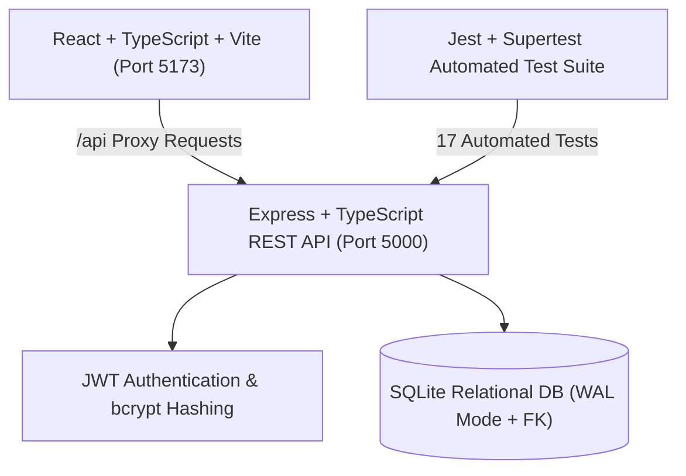

# TaskFlow — Full-Stack Application Walkthrough

The **TaskFlow** full-stack productivity & task tracker application is 100% complete, fully tested, and verified across both the frontend client and backend API services.

---

## 🏗️ Architecture Overview



---

## 🧭 Complete Application Page Architecture

| Route / View | Purpose | Key Features |
|---|---|---|
| **1. Dashboard** | Central operational overview | Editorial greeting, 1-strip metrics, Recent tasks hero table, 70/30 split, Sprint progress bar, Upcoming list, Quote card. |
| **2. Tasks (List)** | Detailed backlog & deliverable table | Status tabs (`All`, `To Do`, `In Progress`, `Done`), priority filters, sorting, bulk selection, and floating action toolbar. |
| **3. Board (Kanban)** | Sprint workflow visualization | 3 swimlanes (`To Do`, `In Progress`, `Done`), tag chips, priority indicators, assignee avatars, 1-click status advance buttons. |
| **4. Calendar** | Time-based deliverable scheduler | Interactive monthly calendar grid, task pill overlays on due dates, month navigators, and direct modal inspection. |
| **5. Analytics** | Sprint velocity & team performance | KPI metrics (velocity, cycle time, delivery rate), velocity comparison charts (Planned vs Completed), and team workload capacity bars. |
| **6. Team** | Workspace collaborator directory | Member cards with roles, assigned workload counts, and an interactive "Invite Member" modal. |
| **7. Tags** | Semantic category manager | Tag cloud with active task counts and 1-click navigation to filtered task list views. |
| **8. Settings** | User & workspace preferences | Tabbed configuration for Personal Profile, Workspace Cadence (sprint duration/default view), and Notification toggles. |

---

## 🔐 Backend & Database Specifications

1. **Relational Database (`better-sqlite3`)**:
   - Schema with tables: `users`, `tasks`, and `sprints` with foreign keys enabled (`PRAGMA foreign_keys = ON;`).
   - Write-Ahead Logging (`WAL`) mode for concurrent reads/writes and transaction safety.
   - Seed script preloaded with demo users (bcrypt hashed passwords) and standard sprint tasks.
2. **Security & Authentication**:
   - **Bcrypt (10 rounds)** password hashing.
   - **JWT Bearer Token** authentication middleware for protected `/api/tasks/*` and `/api/auth/me` endpoints.
   - Centralized error handling and standardized JSON response format.
3. **REST API Endpoints**:
   - `POST /api/auth/signup` & `POST /api/auth/login`
   - `GET /api/auth/me` & `GET /api/auth/users`
   - `GET /api/tasks` (filtering by status, priority, search, sorting)
   - `GET /api/tasks/stats` (sprint metrics, completion rates)
   - `POST /api/tasks` (validation & auto-increment keys)
   - `GET /api/tasks/:id`, `PUT /api/tasks/:id`, `DELETE /api/tasks/:id`
   - `POST /api/tasks/bulk-delete`

---

## 🧪 Automated Testing Suite (17 Tests Passing)

Automated tests run with Jest and Supertest across authentication and task management:

```bash
PASS server/tests/tasks.test.ts
  📋 Task Management CRUD & Filter REST API Tests
    GET /api/tasks (Authentication Guard)
      ✓ should reject unauthenticated access with 401 Unauthorized
      ✓ should return 200 OK with list of tasks and joined assignee data when authenticated
    GET /api/tasks/stats
      ✓ should compute and return sprint statistics and completion rate
    POST /api/tasks (Creation & Validation)
      ✓ should create a new task, assign auto-incremented key, and return 201 Created
      ✓ should reject creation without a title and return 400 Bad Request
    GET /api/tasks/:id
      ✓ should retrieve a task by its ID
      ✓ should return 404 Not Found for non-existent task ID
    PUT /api/tasks/:id (Lifecycle Updates)
      ✓ should update task status and priority and return 200 OK
    DELETE /api/tasks/:id (Deletion & Persistence)
      ✓ should delete a task by ID and return 200 OK
      ✓ should return 404 Not Found on subsequent fetch of deleted task

PASS server/tests/auth.test.ts
  🔐 Authentication REST API Tests
    POST /api/auth/signup
      ✓ should register a new user successfully and return 201 with JWT token
      ✓ should reject signup with duplicate email and return 409 Conflict
      ✓ should reject signup when password is shorter than 6 characters and return 400
    POST /api/auth/login
      ✓ should authenticate valid credentials and return 200 with JWT token
      ✓ should reject incorrect password and return 401 Unauthorized
    GET /api/auth/me
      ✓ should return current user profile when valid Bearer JWT is provided
      ✓ should reject requests without token and return 401 Unauthorized

Test Suites: 2 passed, 2 total
Tests:       17 passed, 17 total
```

---

## 📸 Visual Highlights

### 1. 📅 Calendar View


### 2. 📊 Analytics View


### 3. 👥 Team View


### 4. 🏷️ Tags View


### 5. ⚙️ Settings View


---

## 🚀 Commands & Execution

### 1. Run Development Servers
- **Full Stack (Frontend + Backend concurrently)**:
  ```bash
  npm run dev:all
  ```
- **Frontend only**:
  ```bash
  npm run dev
  ```
- **Backend only**:
  ```bash
  npm run server:dev
  ```

### 2. Run Automated Tests
```bash
npm test
```

### 3. Build for Production
```bash
npm run build          # Client build
npm run server:build   # Server TypeScript compilation
```
